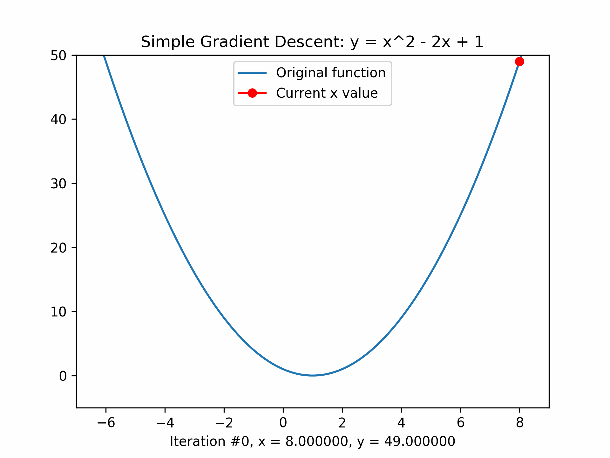

# Getting started
A simple implementation of Gradient Descent for a simple function.
```
y = x^2 - 2x + 1
```

# How to start
```shell
pip install -r requirements.txt

python main.py 
```

Then open an `animation.gif` file.


